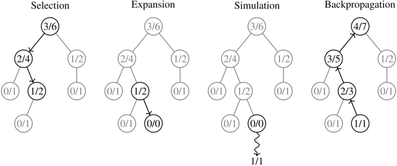

# MCTS : Monte Carlo Tree Search
- Tree search algorithm based on certain parameters
- run alot of games : random moves
- Highest number of simulations are limited
- The best move is the one that has the highest win rate
- The win rate is the number of wins divided by the number of simulations
- more the simulations, more accurate the win rate
 
## Principles of operation

1. Selection
    wi/ni -> exploitation
    c * sqrt(2 * ln(Ni)/ni) -> exploration

    wi stands for the number of wins for the node considered after the i-th move
    
    ni stands for the number of simulations for the node considered after the i-th move
    
    Ni stands for the total number of simulations after the i-th move run by the parent node of the one considered
    
    c is the exploration parameter—theoretically equal to √2; in practice usually chosen empirically

2. Expansion
 - First_move: user, second_move: user2
 - complicated expansion for imperfect information games

 3. Simulation
 - actual complete random game play with selected node
 - 

 4. Backpropagation
    - update the win rate of the node, parent node

reference: https://en.wikipedia.org/wiki/Monte_Carlo_tree_search

## improving performance
- string comparision slower than number comparision
- python 10* slower than C
- don't give card opponent doesn't have in mcts
